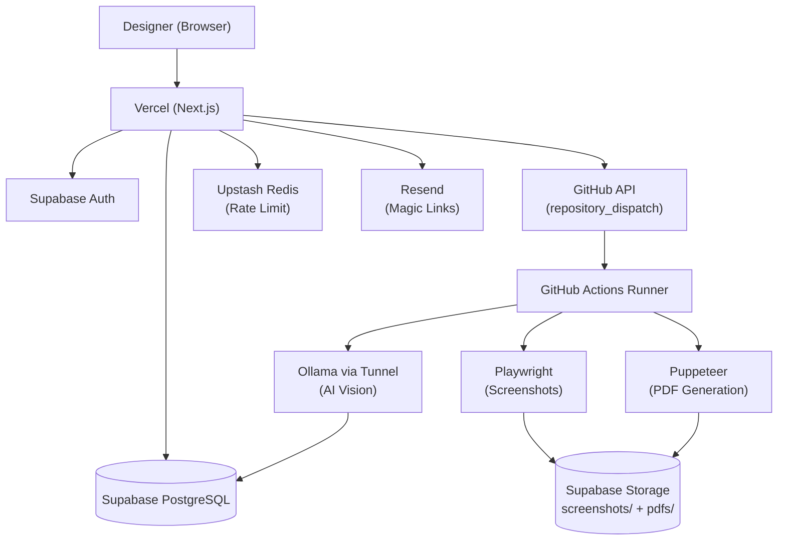

# Landing Reviewer MVP — Fully Free ($0/month)

AI-ревью лендингов для веб-дизайнеров. Загрузите ссылку на Figma, скриншоты или URL — получите экспертный разбор как от Senior Art Director за 60 секунд.

## 🚀 Стек (все БЕСПЛАТНЫЕ тиры)

| Сервис | Назначение | Бесплатный лимит |
|--------|------------|------------------|
| **Vercel** | Хостинг Next.js + API | Hobby — бесплатно навсегда |
| **Supabase** | PostgreSQL + Auth + Storage | 500MB DB, 1GB Storage, 50k MAU |
| **GitHub Actions** | Background workers (Playwright + Puppeteer + Ollama) | 2000 мин/мес на приватных репо |
| **Ollama (локально)** | AI Vision (LLaVA / Qwen2-VL) | Бесплатно на вашем железе |
| **Resend** | Email (magic links) | 3k писем/мес |
| **Upstash Redis** | Rate limiting | 10k запросов/день |

**Никаких платных подписок, никаких серверов для аренды.**

---

## 📦 Быстрый старт

### 1. Подготовка аккаунтов (все бесплатно)

| Сервис | Что сделать |
|--------|-------------|
| **GitHub** | Создайте репозиторий, настройте Secrets (см. ниже) |
| **Vercel** | Import репозиторий, добавьте Environment Variables |
| **Supabase** | Создайте проект, выполните миграции, создайте Storage buckets |
| **Resend** | Добавьте домен, получите API key |
| **Upstash** | Создайте Redis database, получите URL + Token |

### 2. Локальный AI (Ollama) — на вашем Mac

```bash
# 1. Установите Ollama
# https://ollama.ai/download (macOS)

# 2. Скачайте vision модель (нужно 8-16GB RAM)
ollama pull qwen2.5vl:7b    # рекомендуется (качество/скорость)
# или ollama pull llava:13b  # если больше RAM
# или ollama pull qwen2.5vl:2b  # если мало RAM (быстрее, хуже качество)

# 3. Запустите сервер
ollama serve

# 4. Создайте публичный туннель (выберите один):
# Вариант А: ngrok (бесплатно, URL меняется при перезапуске)
ngrok http 11434

# Вариант Б: Cloudflare Tunnel (бесплатно, стабильный URL)
cloudflared tunnel --url http://localhost:11434
```

### 3. Настройте GitHub Secrets

В Settings → Secrets and variables → Actions добавьте:

| Secret | Значение |
|--------|----------|
| `SUPABASE_URL` | `https://your-project.supabase.co` |
| `SUPABASE_SERVICE_KEY` | Service Role Key из Supabase (Settings → API) |
| `OLLAMA_URL` | Ваш публичный туннель (например `https://abc123.ngrok-free.app`) |
| `OLLAMA_MODEL` | `qwen2.5vl:7b` (или другая) |

### 4. Настройте Vercel Environment Variables

В Vercel Dashboard → Settings → Environment Variables добавьте все из `.env.example`:

```env
NEXT_PUBLIC_SUPABASE_URL=
NEXT_PUBLIC_SUPABASE_ANON_KEY=
SUPABASE_SERVICE_KEY=
GITHUB_ACTIONS_TOKEN=ghp_xxx  # Classic PAT с scope "repo"
GITHUB_REPO=your-username/landing-reviewer-mvp
OLLAMA_URL=https://your-tunnel.ngrok-free.app
OLLAMA_MODEL=qwen2.5vl:7b
RESEND_API_KEY=re_xxx
EMAIL_FROM=Landing Reviewer <noreply@yourdomain.com>
UPSTASH_REDIS_REST_URL=https://xxx.upstash.io
UPSTASH_REDIS_REST_TOKEN=xxx
NEXT_PUBLIC_APP_URL=https://your-app.vercel.app
```

### 5. Supabase: Миграции и Storage

```bash
# Локально (если есть Docker)
npx supabase start
npx supabase db push

# Или в облачном Supabase: SQL Editor → выполните supabase/migrations/20240101000000_initial_schema.sql
```

Создайте 2 Storage buckets в Supabase Dashboard → Storage:
- `screenshots` (Public: false)
- `pdfs` (Public: false)

### 6. GitHub Personal Access Token

Settings → Developer settings → Personal access tokens → Tokens (classic) → Generate new:
- Name: `Landing Reviewer Actions`
- Expiration: No expiration
- Scopes: ✅ `repo` (Full control of private repositories)

### 7. Деплой

```bash
# Push в GitHub
git add .
git commit -m "Initial MVP"
git push origin main

# Vercel автоматически задеплоит
# GitHub Actions будет ждать repository_dispatch
```

---

## 🏗 Архитектура (Zero-Cost)



### Поток данных:

```
1. User загружает URL/Figma/Files → POST /api/analyze (Vercel)
2. Rate limit check (Upstash) → Free tier limits check (Supabase)
3. Создаётся project + version (status: queued) в Supabase
4. Vercel вызывает GitHub API: repository_dispatch → analyze-landing
5. GitHub Actions запускается (бесплатный ubuntu-latest runner):
   a) capture-screenshots.ts → Playwright → 3 viewport PNGs → Supabase Storage
   b) ai-analysis.ts → Ollama (via tunnel) → JSON анализ → Supabase DB
   c) generate-pdf.ts → Puppeteer → PDF → Supabase Storage
   d) Обновляет version.status = ready
6. User polling /api/status/[jobId] → видит результат на /preview/[jobId]
```

---

## 🗄 База данных

Миграция: `supabase/migrations/20240101000000_initial_schema.sql`

Таблицы: `users`, `projects`, `versions`, `reports`, `comparisons`, `share_links`, `chat_sessions`, `subscriptions`

RLS policies настроены для изоляции данных пользователей.

---

## 📁 Структура проекта

```
src/
├── app/
│   ├── api/
│   │   ├── analyze/route.ts      # Создание job'а → GitHub Actions dispatch
│   │   └── status/[jobId]/route.ts  # Polling статуса
│   ├── preview/[jobId]/page.tsx  # Страница результатов (мок-данные работают без AI)
│   ├── layout.tsx                # Root layout + fonts
│   ├── globals.css               # Tailwind + CSS variables
│   └── page.tsx                  # Landing + Upload form (3 таба)
├── components/ui/                # shadcn/ui компоненты
├── lib/
│   ├── supabase/client.ts        # Browser client
│   ├── supabase/server.ts        # Server client (RLS)
│   ├── rate-limit.ts             # Upstash sliding window
│   └── utils.ts                  # Утилиты
├── scripts/                      # GitHub Actions scripts
│   ├── capture-screenshots.ts    # Playwright → screenshots
│   ├── ai-analysis.ts            # Ollama Vision → JSON
│   └── generate-pdf.ts           # Puppeteer → PDF
└── types/database.ts             # Типы БД

.github/workflows/analyze.yml     # GitHub Actions pipeline
```

---

## 🧪 Локальная разработка

```bash
# Установите зависимости
npm install

# Скопируйте env
cp .env.example .env.local
# Заполните ключи (Supabase, Upstash, Resend — Ollama/GitHub не нужны локально)

# Запустите Supabase локально
npx supabase start

# Терминал 1: Next.js
npm run dev

# Терминал 2: Ollama (для локального теста AI)
ollama serve

# Тест скриптов вручную:
npm run scripts:capture <versionId>
npm run scripts:analyze <versionId>
npm run scripts:pdf <versionId>
```

**Важно:** Локально GitHub Actions не запускается. Страница `/preview/[jobId]` показывает мок-данные (встроенные в код), поэтому можно тестировать UI без настроенного AI.

---

## ⚙️ Ограничения бесплатной версии

| Ограничение | Значение | Решение |
|-------------|----------|---------|
| GitHub Actions минут | 2000/мес | ~60-80 разборов/мес (30 мин на job) |
| Ollama RAM | 8-16GB для qwen2.5vl:7b | Используйте `qwen2.5vl:2b` (4GB RAM) |
| Ollama качество | Ниже GPT-4o Vision | Достаточно для MVP, потом переезд на API |
| Туннель (ngrok) | URL меняется | Обновляйте `OLLAMA_URL` в GitHub Secrets |
| Параллельность | 1 job за раз | Добавьте очередь в Supabase при росте |
| Cold start | 2-3 мин на первый job | Приемлемо для MVP |

---

## 📈 План масштабирования (после первых платящих пользователей)

1. **Workers** → Fly.io ($5/мес) или Railway ($5/мес) — постоянные серверы, нет cold start
2. **AI** → OpenAI GPT-4o Vision API (~$0.02/разбор) — лучшее качество, не нужно держать Ollama
3. **Queue** → Inngest Free или Redis-based очередь в Supabase
4. **Payments** → ЮKassa (РФ) + Stripe (Intl) — комиссия только с транзакций
5. **CDN** → Cloudflare R2 для скриншотов/PDF (zero egress)

---

## 📝 Полезные команды

```bash
# Логи GitHub Actions
gh run list --workflow=analyze.yml --limit=10
gh run view <run-id> --log

# Тест Ollama локально
curl http://localhost:11434/api/chat -d '{"model":"qwen2.5vl:7b","messages":[{"role":"user","content":"Hi"}],"stream":false}'

# Supabase Studio
npx supabase studio

# Обновить типы БД после миграций
npx supabase gen types typescript --local > src/types/database.ts
```

---

## 🤝 Контрибьюция

MIT License — используйте, форкайте, улучшайте.

---

*Сделано для веб-дизайнеров, которые хотят экспертный взгляд без бюджета на арт-директора.*